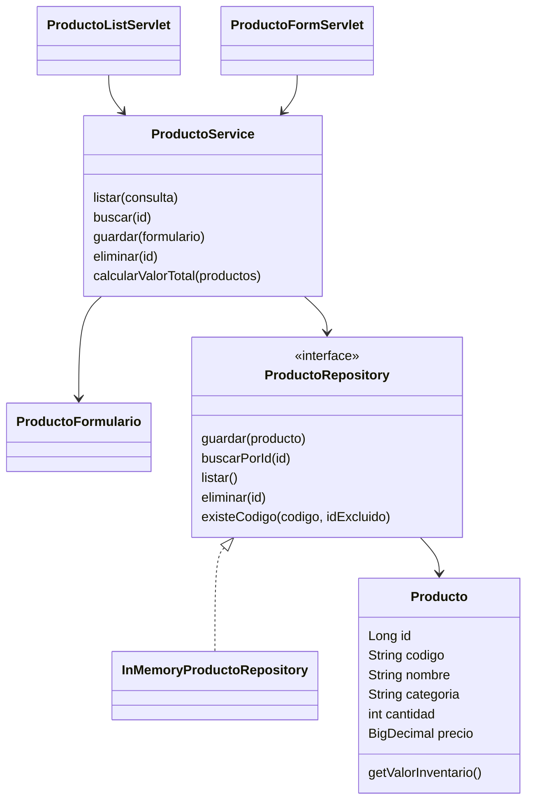
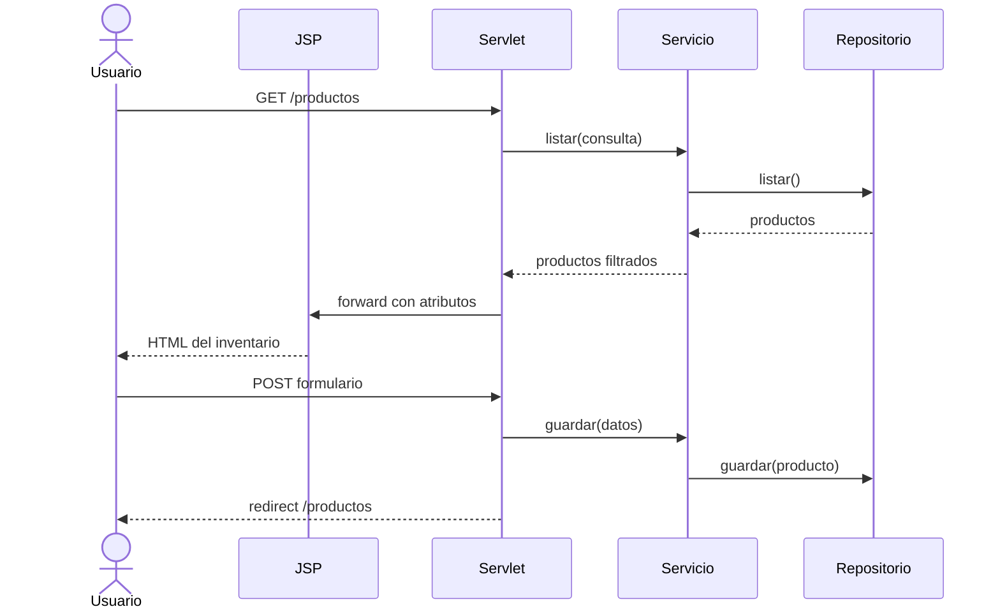

# Informe técnico de construcción

## 1. Identificación

- **Evidencia:** GA7-220501096-AA2-EV02.
- **Aprendiz:** Andrés Avendaño López.
- **Ficha:** 3235904.
- **Módulo:** gestión web de inventario de productos.

## 2. Objetivo

Construir y probar un módulo web que permita registrar, consultar, editar y eliminar productos. La solución aplica una arquitectura por capas, formularios HTML, servlets con métodos GET y POST, vistas JSP y control de versiones Git.

## 3. Arquitectura seleccionada

La solución aplica el patrón **MVC**:

- **Modelo:** `Producto` y `ProductoFormulario`.
- **Vista:** páginas JSP con Expression Language y etiquetas JSTL.
- **Controlador:** `ProductoListServlet` y `ProductoFormServlet`.
- **Servicio:** `ProductoService` concentra validaciones y reglas de negocio.
- **Repositorio:** `ProductoRepository` desacopla el dominio del mecanismo de persistencia.

## 4. Flujo de una solicitud

## 5. Decisiones técnicas

- **Java 17:** versión LTS ampliamente compatible.
- **Jakarta Servlet/JSP:** tecnologías solicitadas para el componente formativo.
- **Maven:** administración reproducible de dependencias, pruebas y empaquetado WAR.
- **Tomcat 10.1:** contenedor compatible con el espacio de nombres `jakarta.*`.
- **Repositorio en memoria:** facilita la evaluación sin instalar una base de datos; puede sustituirse por JDBC conservando la interfaz.
- **JSTL y EL:** evitan código Java dentro de las vistas JSP.
- **Post/Redirect/Get:** evita duplicar operaciones al recargar después de guardar.
- **UTF-8:** soporta correctamente tildes y caracteres del español.

## 6. Seguridad y calidad

- Las modificaciones y eliminaciones se realizan por POST.
- La salida de información del usuario se escapa con `<c:out>`.
- El servidor valida los datos aunque el navegador también aporte restricciones HTML.
- Los JSP están dentro de `WEB-INF` para impedir el acceso directo.
- El repositorio sincroniza sus operaciones para atender peticiones concurrentes.
- Las excepciones por recursos inexistentes producen una respuesta 404.

## 7. Plan de trabajo ejecutado

| Fase | Actividad | Resultado |
|---|---|---|
| Análisis | Definir alcance, historias y reglas | Casos CRUD y criterios documentados |
| Diseño | Modelar clases, rutas y vistas | Arquitectura MVC por capas |
| Construcción | Implementar modelo, repositorio, servicio, servlets y JSP | Módulo web funcional |
| Pruebas | Crear pruebas unitarias y ejecutar Maven | Reporte reproducible en `target/surefire-reports` |
| Versionamiento | Inicializar Git y registrar el código | Historial incluido en la carpeta del proyecto |
| Entrega | Empaquetar fuentes y documentación | Archivo ZIP de evidencia |

## 8. Mejoras futuras

- Implementar persistencia JDBC con MySQL o PostgreSQL.
- Incorporar autenticación y roles.
- Añadir protección CSRF para un entorno público.
- Registrar entradas y salidas de inventario mediante movimientos auditables.
- Agregar pruebas de integración ejecutando el WAR en un contenedor.
